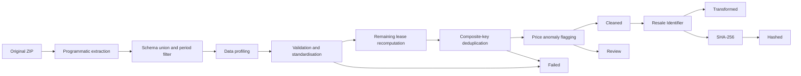

# HDB Senior Data Engineer Technical Test Solution

A complete and reproducible Python ETL solution for HDB resale-flat-price analysis, together with AWS data-ingestion and Tableau/Athena exploitation architecture designs.

---

# Submission Overview

## Part 1 — Developing Data Pipelines

**Purpose:** Build, validate, transform, reconcile, and document the HDB resale-flat-price dataset for January 2012 through December 2016.

| Deliverable | Link |
|---|---|
| Part 1 design and analysis | [Open Part 1 ETL Design](docs/PART1_ETL_DESIGN.md) |
| Executable walkthrough | [Open Jupyter Notebook](notebooks/hdb_resale_pipeline.ipynb) |
| Production-style Python code | [Browse ETL Source Code](src/hdb_pipeline/) |
| Automated verification | [Open Tests](tests/test_pipeline.py) |
| Generated datasets | [Browse Outputs](output/) |
| Pipeline flow source | [Open Mermaid Diagram](docs/diagrams/pipeline_flow.mmd) |

### Part 1 processing flow



### Part 1 module structure

```text
src/hdb_pipeline/
├── cli.py             # main() and command-line arguments
├── config.py          # central pipeline settings
├── ingestion.py       # ZIP/directory/CSV discovery, raw copy, schema union
├── quality.py         # profiling, validation, lease, deduplication, anomaly flags
├── transformation.py  # Resale Identifier and SHA-256
├── output.py          # mandatory outputs and run manifest
└── pipeline.py        # concise end-to-end ETL orchestration
```

The primary example uses the original downloaded ZIP, while `--input-path` also accepts an extracted directory or one CSV file.


## Part 2 — AWS Data Ingestion & Data Exploitation Architecture

**Purpose:** Operationalise the pipeline on AWS with secure public-source ingestion, private-VPC processing, S3 storage, and private Tableau access to Athena.

| Deliverable | Link |
|---|---|
| Part 2 design and assumptions | [Open Part 2 AWS Architecture](docs/PART2_AWS_ARCHITECTURE.md) |
| Batch ingestion architecture | [Open Ingestion PNG](docs/diagrams/data_ingestion_architecture.png) |
| Tableau/Athena architecture | [Open Exploitation PNG](docs/diagrams/data_exploitation_architecture.png) |
| Editable diagram sources | [Browse Diagram Files](docs/diagrams/) |

### Data Ingestion Architecture

[](docs/diagrams/data_ingestion_architecture.png)

### Tableau and Athena Data Exploitation Architecture

[](docs/diagrams/data_exploitation_architecture.png)

---

## Quick start

```bash
python -m venv .venv
source .venv/bin/activate
pip install -r requirements.txt
pip install -e .
python -m hdb_pipeline.cli \
  --input-path data/input/ResaleFlatPrices.zip \
  --output-dir output \
  --as-of-date 2026-07-17
```

Run the automated tests:

```bash
pytest -q
```

## Output layout

```text
output/
├── raw/           # Unmodified contributing source CSV files
├── staging/       # Schema-unioned, in-scope master dataset
├── profiling/     # Column profiles and category distributions
├── cleaned/       # Valid and deduplicated records; anomalies retained and flagged
├── failed/        # Invalid rows and lower-price composite-key duplicates
├── review/        # Potential price anomalies for analyst review
├── transformed/   # Cleaned data plus clear-text Resale Identifier
├── hashed/        # Cleaned data plus SHA-256 hashed identifier
└── run_manifest.json
```

## Final reconciliation

| Dataset | Rows |
|---|---:|
| Master | 92,544 |
| Cleaned | 90,948 |
| Failed | 1,596 |
| Potential anomalies for review | 142 |
| Transformed | 90,948 |
| Hashed | 90,948 |

The principal invariant is:

```text
92,544 Master = 90,948 Cleaned + 1,596 Failed
```

## Repository notes

- The assessment PDF must not be committed.
- The personal bilingual HTML study guide is included in the downloadable ZIP under `local_study/`, but `.gitignore` excludes that directory from Git.
- Before publishing, follow [GITHUB_SUBMISSION_CHECKLIST.md](GITHUB_SUBMISSION_CHECKLIST.md).
- Use `git status` and `git check-ignore` to confirm that private study files and the assessment brief are excluded.
