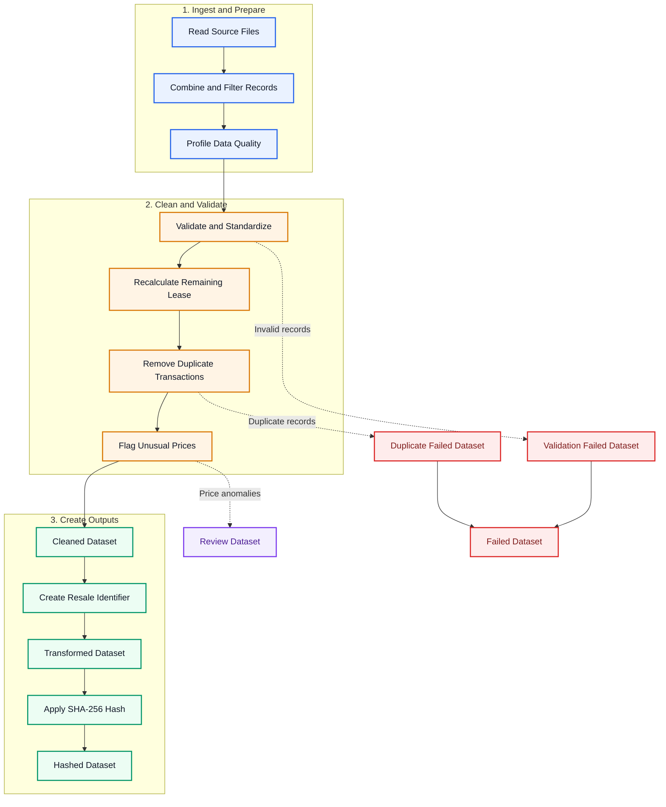
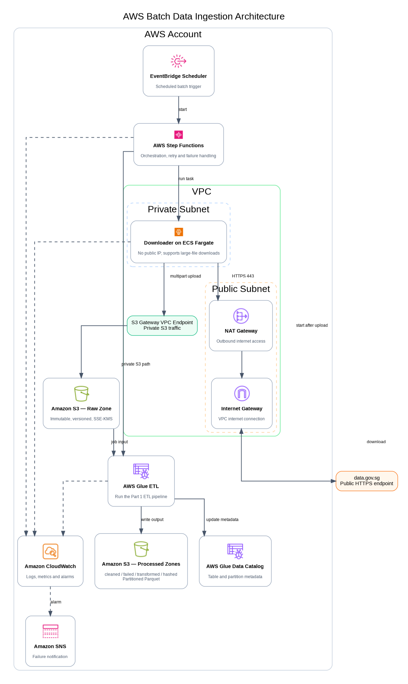

# HDB SDE Technical Test

- Part 1: Developing Data Pipelines （Python ETL pipeline）
- Part 2: Architecting Data Ingestion & Data Exploitation Solution Patterns （AWS）

## Part 1: Developing Data Pipelines

### 1.1 Objective

The pipeline is designed to:

- ingest and combine the required HDB resale source files;
- validate and standardise the data;
- recalculate the remaining lease;
- remove duplicate transactions;
- flag unusual resale prices;
- create the Resale Identifier and SHA-256 hash;
- produce reconciled output datasets.

### 1.2 Processing flow



### 1.3 Module structure

```text
src/hdb_pipeline/
├── main.py             # command-line entry point
├── config.py           # pipeline configuration
├── ingestion.py        # source discovery, extraction and schema union
├── data_quality.py     # profiling, validation, lease, deduplication and anomaly detection
├── transformation.py   # Resale Identifier and SHA-256 hashing
├── output.py           # output datasets and run manifest
└── pipeline.py         # end-to-end ETL orchestration
```

### 1.4 Quick start

#### Option 1: Conda

The following commands assume that Conda is already installed.

```bash
conda create -n g2hdb python=3.10
conda activate g2hdb
```

#### Option 2: Python venv

Use Python's built-in virtual environment if Conda is not available.

```bash
python3 -m venv .venv
source .venv/bin/activate
```

#### Install Dependencies

```bash
pip install -r requirements.txt
pip install -e .
```

#### Run the Pipeline

Run the following command from the project root:

```bash
PYTHONPATH=src python -m hdb_pipeline.main \
  --input-path data/input/ResaleFlatPrices.zip \
  --output-dir output \
  --as-of-date 2026-07-18
```

#### Run the Notebook

```bash
jupyter notebook notebooks/hdb_resale_pipeline.ipynb
```

#### Run Tests

```bash
PYTHONPATH=src pytest -q
```

## Part 2: Data Ingestion Architecting & Data Exploitation Architecting

**AWS Data Ingestion & Data Exploitation Architecture**

### 2.1. AWS Data Ingestion Architecture

#### 2.1.1 Objective

The solution ingests batch files from the public `data.gov.sg` endpoint into Amazon S3.

The design supports:

- files larger than 100 MB;
- processing within private subnets;
- controlled outbound internet access;
- secure storage in Amazon S3;
- automated ETL processing and monitoring.

#### 2.1.2 Processing Flow




The workflow is:

1. EventBridge Scheduler starts the Step Functions workflow.
2. Step Functions runs the downloader on ECS Fargate.
3. The downloader accesses `data.gov.sg` through the NAT Gateway and Internet Gateway.
4. The file is uploaded to the S3 Raw Zone through the S3 Gateway VPC Endpoint using multipart upload.
5. After the download succeeds, Step Functions starts AWS Glue.
6. AWS Glue runs the Part 1 ETL pipeline.
7. The processed datasets are written to the S3 Processed Zone and registered in the Glue Data Catalog.
8. CloudWatch records logs and Amazon SNS sends failure notifications.

#### 2.1.3 Main Components

| Component | Purpose |
|---|---|
| EventBridge Scheduler | Starts the workflow on a schedule. It is disabled by default. |
| Step Functions | Orchestrates the Fargate downloader and Glue ETL job. |
| ECS Fargate | Runs the containerised downloader without managing EC2 servers. |
| NAT Gateway | Provides outbound internet access from the private subnet. |
| S3 Gateway VPC Endpoint | Provides private access from the VPC to Amazon S3. |
| S3 Raw Zone | Stores original files with versioning and SSE-KMS encryption. |
| AWS Glue ETL | Runs the Part 1 ETL pipeline. |
| S3 Processed Zone | Stores cleaned, failed, transformed and hashed datasets in Parquet format. |
| Glue Data Catalog | Stores table and partition metadata. |
| CloudWatch and SNS | Provide monitoring and failure notification. |

#### 2.1.4 Network Design

The downloader runs in a private subnet without a public IP address.

It accesses `data.gov.sg` through:

```text
Private Subnet
→ NAT Gateway
→ Internet Gateway
→ data.gov.sg
```

### 2.2 AWS Data Exploitation Architecture

#### 2.2.1 Objective

#### 2.2.2 Processing Flow

#### 2.2.3 Main Components

#### 2.2.4 Network Design

### 2.3 Security, Scalability, and Performance Assumptions

#### 2.3.1 Security

#### 2.3.2 Scalability and Reliability

#### 2.3.3 Performance

#### 2.3.4 General Assumptions


---

- [Data Ingestion Architecture](docs/disable-v1/data_ingestion_architecture.png)
- [Data Exploitation Architecture](docs/disable-v1/data_exploitation_architecture.png)

