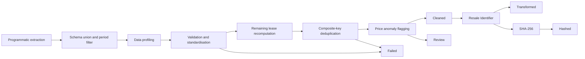

# HDB Senior Data Engineer Technical Test

- Part 1: Python ETL pipeline
- Part 2: AWS architecture design

## Part 1 - Python ETL pipeline

### Part 1 processing flow



### Part 1 module structure

```text
src/hdb_pipeline/
├── main.py             # main() and command-line arguments
├── config.py          # central pipeline settings
├── ingestion.py       # ZIP/directory/CSV discovery, raw copy, schema union
├── quality.py         # profiling, validation, lease, deduplication, anomaly flags
├── transformation.py  # Resale Identifier and SHA-256
├── output.py          # mandatory outputs and run manifest
└── pipeline.py        # concise end-to-end ETL orchestration
```

### Part 1 Quick start

```bash
conda create -n g2hdb python=3.10
conda activate g2hdb
```

```
python -m venv .venv
source .venv/bin/activate
pip install -r requirements.txt
pip install -e .
python -m hdb_pipeline.main \
  --input-path data/input/ResaleFlatPrices.zip \
  --output-dir output \
  --as-of-date 2026-07-17
```

Run the automated tests:

```bash
pytest -q
```


## Part 2 — AWS Data Ingestion & Data Exploitation Architecture
