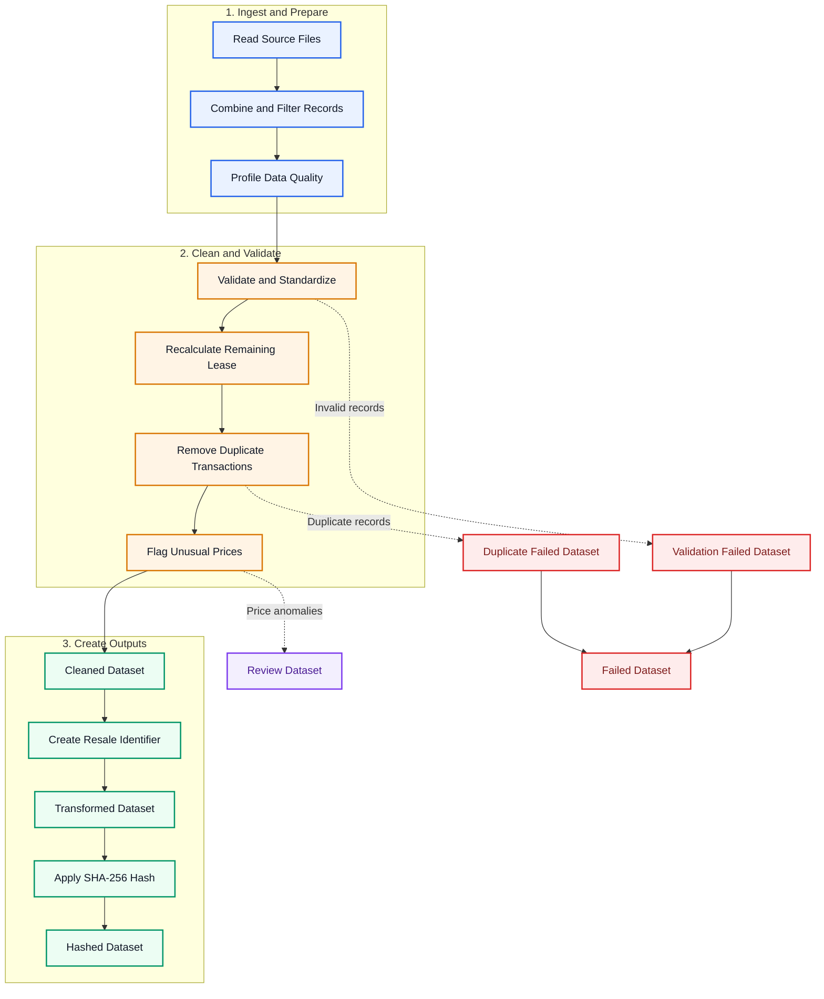

# HDB SDE Technical Test

- Part 1: Developing Data Pipelines （Python ETL pipeline）
- Part 2: Architecting Data Ingestion & Data Exploitation Solution Patterns （AWS）

## Part 1: Developing Data Pipelines

### Part 1 processing flow



### Part 1 module structure

```text
src/hdb_pipeline/
├── main.py             # command-line entry point
├── config.py           # pipeline configuration
├── ingestion.py        # source discovery, extraction and schema union
├── data_quality.py     # profiling, validation, lease, deduplication and anomaly detection
├── transformation.py   # Resale Identifier and SHA-256 hashing
├── output.py           # output datasets and run manifest
└── pipeline.py         # end-to-end ETL orchestration
```

### Part 1 Quick start

#### Option 1: Conda

The following commands assume that Conda is already installed.

```bash
conda create -n g2hdb python=3.10
conda activate g2hdb
```

#### Option 2: Python venv

Use Python's built-in virtual environment if Conda is not available.

```bash
python3 -m venv .venv
source .venv/bin/activate
```

### Install Dependencies

```bash
pip install -r requirements.txt
pip install -e .
```

### Run the Pipeline

Run the following command from the project root:

```bash
PYTHONPATH=src python -m hdb_pipeline.main \
  --input-path data/input/ResaleFlatPrices.zip \
  --output-dir output \
  --as-of-date 2026-07-18
```

### Run the Notebook

```bash
jupyter notebook notebooks/hdb_resale_pipeline.ipynb
```

### Run Tests

```bash
PYTHONPATH=src pytest -q
```

## Part 2: Architecting Data Ingestion & Data Exploitation Solution Patterns

**AWS Data Ingestion & Data Exploitation Architecture**

- [Part 2 AWS Architecture and Assumptions](docs/PART2_AWS_ARCHITECTURE.md)
- [Data Ingestion Architecture](docs/diagrams/data_ingestion_architecture.png)
- [Data Exploitation Architecture](docs/diagrams/data_exploitation_architecture.png)

