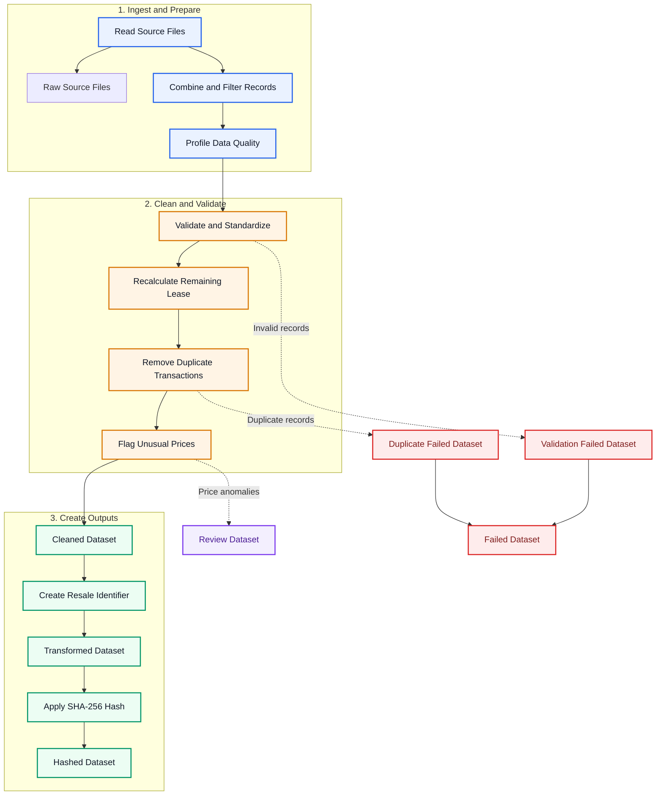
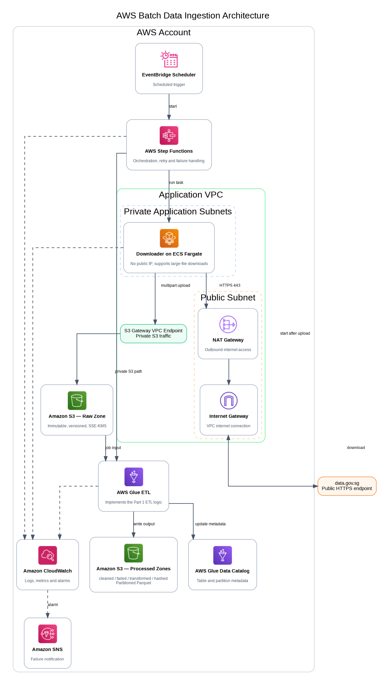
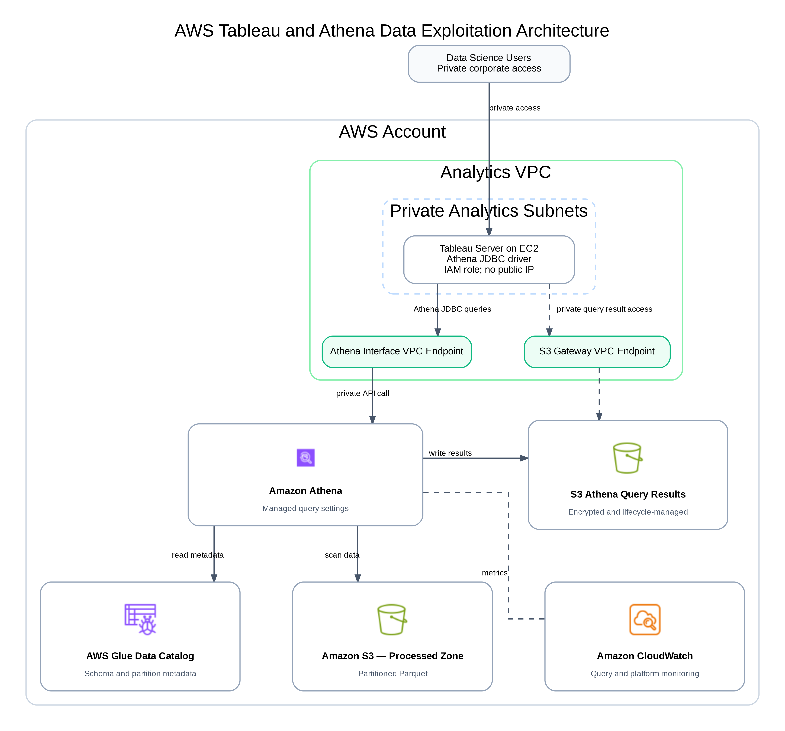

# HDB SDE Technical Test

- Part 1: Developing Data Pipelines （Python ETL pipeline）
- Part 2: Architecting Data Ingestion & Data Exploitation Solution Patterns （AWS）

## Part 1: Developing Data Pipelines

### 1.1 Objective

The pipeline is designed to:

- ingest and combine the required HDB resale source files;
- preserve the contributing source files in the Raw output;
- validate and standardise the data;
- recalculate the remaining lease;
- remove duplicate transactions;
- flag unusual resale prices;
- create the Resale Identifier and generate its SHA-256 hash
- produce cleaned, failed, review, transformed and hashed output datasets.

### 1.2 Processing flow



Review dataset: The Review dataset is a non-exclusive subset of the Cleaned dataset containing records flagged for price review. Anomalous-price flags do not automatically reject otherwise valid records.

### 1.3 Module structure

```text
src/hdb_pipeline/
├── main.py             # command-line entry point
├── config.py           # pipeline configuration
├── ingestion.py        # source discovery, extraction and schema union
├── data_quality.py     # profiling, validation, lease, deduplication and anomaly detection
├── transformation.py   # Resale Identifier and SHA-256 hashing
├── output.py           # output datasets and run manifest
└── pipeline.py         # end-to-end ETL orchestration
```

### 1.4 Quick start

#### Option 1: Conda

The following commands assume that Conda is already installed.

```bash
conda create -n g2hdb python=3.10
conda activate g2hdb
```

#### Option 2: Python venv

Use Python's built-in virtual environment if Conda is not available.

```bash
python3 -m venv .venv
source .venv/bin/activate
```

#### Install Dependencies

```bash
pip install -r requirements.txt
pip install -e .
```

#### Run the Pipeline

Run the following command from the project root:

```bash
PYTHONPATH=src python -m hdb_pipeline.main \
  --input-path data/input/ResaleFlatPrices.zip \
  --output-dir output \
  --as-of-date 2026-07-18
```

#### Run the Notebook

```bash
jupyter notebook notebooks/hdb_resale_pipeline.ipynb
```

#### Run Tests

```bash
PYTHONPATH=src pytest -q
```

## Part 2: Architecting Data Ingestion & Data Exploitation Solution Patterns

**AWS Data Ingestion & Data Exploitation Architecture**

### 2.1. AWS Data Ingestion Architecture

#### 2.1.1 Objective

The solution ingests batch files from the public `data.gov.sg` endpoint into Amazon S3.

The design supports:

- files larger than 100 MB;
- processing within private subnets;
- controlled outbound internet access;
- secure storage in Amazon S3;
- automated ETL processing and monitoring.

#### 2.1.2 Processing Flow



The workflow is:

1. EventBridge Scheduler starts the Step Functions workflow.
2. Step Functions runs the downloader(`python application packaged as a Docker container`) on ECS Fargate.
3. The downloader accesses `data.gov.sg` through the NAT Gateway and Internet Gateway.
4. The file is uploaded to the S3 Raw Zone through the S3 Gateway VPC Endpoint using multipart upload.
5. After the download and S3 upload succeed, Step Functions starts the AWS Glue ETL job.
6. AWS Glue implements the Part 1 ETL logic.
7. The processed datasets are written to the S3 Processed Zone and registered in the Glue Data Catalog.
8. CloudWatch collects logs and metrics, while Amazon SNS sends failure notifications.

#### 2.1.3 Main Components

| Component | Purpose |
|---|---|
| EventBridge Scheduler | Starts the workflow on a schedule. It is disabled by default. |
| Step Functions | Orchestrates the Fargate downloader and Glue ETL job. |
| ECS Fargate | Runs the containerised downloader without managing EC2 servers. |
| NAT Gateway | Provides outbound internet access from the private subnets. |
| S3 Gateway VPC Endpoint | Provides private access from the VPC to Amazon S3. |
| S3 Raw Zone | Stores original files with versioning and SSE-KMS encryption. |
| AWS Glue ETL | Implements the Part 1 ETL logic at scale. |
| S3 Processed Zone | Stores cleaned, failed, transformed and hashed datasets in Parquet format. |
| Glue Data Catalog | Stores table and partition metadata. |
| CloudWatch and SNS | Provide logs, metrics, alarms and failure notifications. |

#### 2.1.4 Network Design

The downloader runs in a private subnets without a public IP address.

It accesses `data.gov.sg` through:

```text
Private Application Subnets
→ NAT Gateway
→ Internet Gateway
→ data.gov.sg
```

### 2.2 AWS Data Exploitation Architecture

#### 2.2.1 Objective

The solution allows internal users to analyse the processed HDB resale datasets through Tableau and Amazon Athena.

The design supports:

- private access to Tableau;
- serverless SQL queries with Amazon Athena;
- metadata management through the AWS Glue Data Catalog;
- partitioned Parquet data in Amazon S3;
- controlled query results, encryption and monitoring.

#### 2.2.2 Processing Flow



The workflow is:

1. Internal users access Tableau through a private connection or VPN.
2. Tableau runs on Amazon EC2 in a private subnet without a public IP address.
3. Tableau submits SQL queries to Amazon Athena through the Athena JDBC driver.
4. The Athena Interface VPC Endpoint provides private access to the Athena API.
5. Athena reads table and partition metadata from the AWS Glue Data Catalog.
6. Athena queries the partitioned Parquet datasets in the S3 Processed Zone.
7. Query results are written to the S3 Athena Query Results bucket.
8. The Athena Workgroup controls the result location, encryption and query limits.
9. IAM provides access control, while CloudWatch provides logging, metrics and monitoring.

#### 2.2.3 Main Components

| Component | Purpose |
|---|---|
| Internal Users | Access Tableau dashboards and analytical reports. |
| Tableau on Amazon EC2 | Provides dashboards and submits SQL queries to Athena. |
| Athena JDBC/ODBC Driver | Connects Tableau to Amazon Athena. |
| Athena Interface VPC Endpoint | Provides private access from the VPC to the Athena API. |
| Amazon Athena | Runs serverless SQL queries on data stored in Amazon S3. |
| Athena Workgroup | Controls query settings, result location, encryption and query limits. |
| AWS Glue Data Catalog | Stores table, schema and partition metadata. |
| S3 Processed Zone | Stores processed datasets in partitioned Parquet format. |
| S3 Athena Query Results | Stores output files produced by Athena queries. |
| S3 Gateway VPC Endpoint | Provides private access from EC2 to the Athena query results in S3. |
| IAM, KMS and CloudWatch | Provide access control, encryption and monitoring. |

#### 2.2.4 Network Design

Tableau runs on Amazon EC2 in the Private Application Subnets of the Application VPC and has no public IP address.

Internal users access Tableau through an approved private connection or VPN:

```text
Internal Users
→ Private Access / VPN
→ Tableau on Amazon EC2
```

### 2.3 Security, Scalability, and Performance Assumptions

#### 2.3.1 Security

- Resources in private subnets have no public IP addresses.
- IAM roles follow the principle of least privilege.
- S3 buckets block public access and use SSE-KMS encryption.
- Athena and S3 traffic use VPC endpoints where applicable.

#### 2.3.2 Scalability and Reliability

- ECS Fargate CPU and memory can be adjusted for larger source files.
- S3 multipart upload supports large-file ingestion and retry of failed parts.
- Step Functions retries temporary failures and starts Glue only after a successful download.
- AWS Glue can scale processing capacity based on data volume.

#### 2.3.3 Performance

- Processed datasets are stored in Parquet format.
- Data is partitioned by suitable fields such as resale year and month.
- Athena Workgroup settings help control query execution and scanned data.
- Glue jobs should process only new or changed source files where possible.

#### 2.3.4 General Assumptions

- The AWS Region supports all services used in the architecture.
- Tableau is installed on an EC2 instance in a private subnet.
- Internal users access Tableau through an approved private network connection.
- The Part 1 ETL logic is reimplemented in AWS Glue.
- Bucket names, IAM policies, KMS keys and endpoint policies are configured during deployment.
